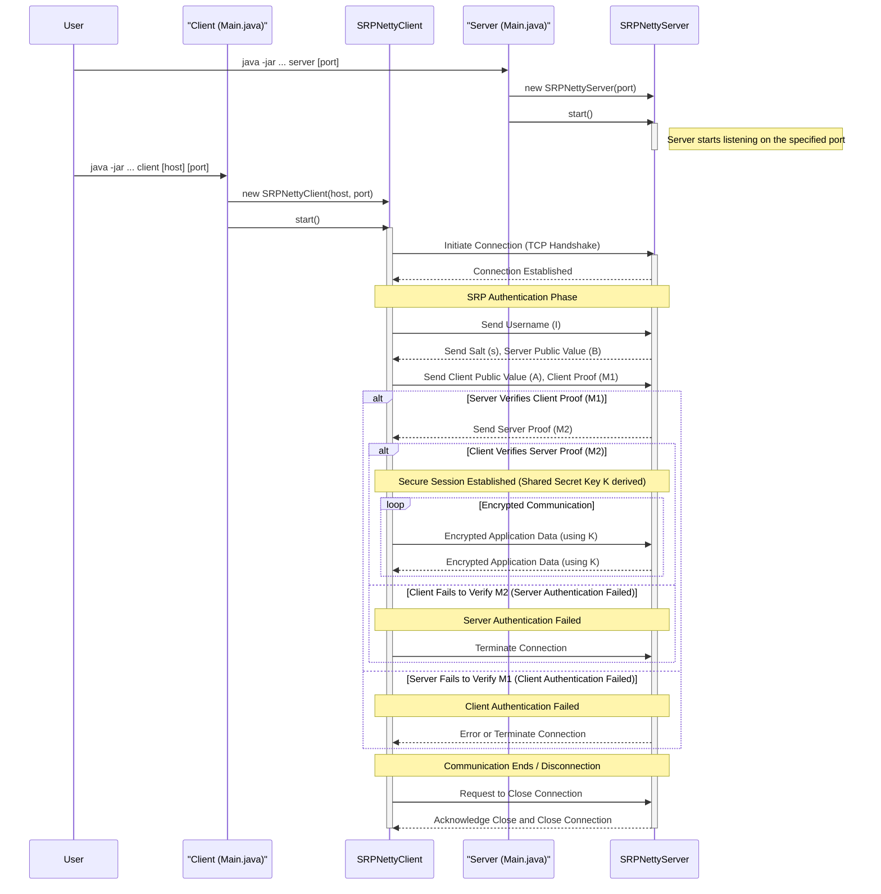

# SRP-Netty Secure Communication System

A secure client-server communication system using Secure Remote Password (SRP) protocol implemented with Netty.

## Features

- Zero-knowledge password authentication
- Mutual authentication between client and server
- AES-256 encrypted message exchange
- Docker support for containerized deployment
- Comprehensive logging for debugging

## Prerequisites

- Java 11 or higher
- Maven 3.6+
- Docker and Docker Compose (optional)

## Building the Project

```bash
# Clone the repository
git clone https://github.com/yourusername/srp-netty-project.git
cd srp-netty-project

# Build with Maven
mvn clean package

# Or build with Docker
docker build -t srp-netty .
```

## workflow
